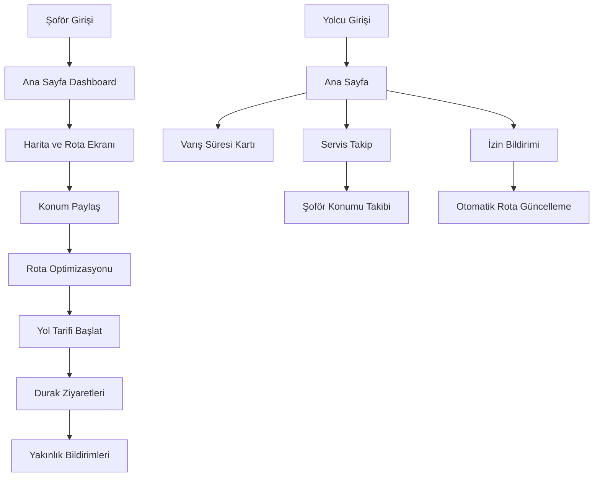

# Servis Takip Uygulaması - Gelişmiş Özellikler Gereksinimleri

## 1. Proje Genel Bakış

Mevcut Flutter tabanlı servis takip uygulamasının geliştirilmesi ve yeni özelliklerin entegrasyonu. Uygulama şoför ve yolcu panelleri ile Firebase backend kullanarak gerçek zamanlı konum takibi, rota optimizasyonu ve bildirim sistemi sağlamaktadır.

- **Ana Amaç**: Şoför ve yolcular arasında gelişmiş iletişim, gerçek zamanlı takip ve otomatik rota yönetimi
- **Hedef Kullanıcılar**: Servis şoförleri ve yolcular
- **Değer Önerisi**: Akıllı rota optimizasyonu, gerçek zamanlı bildirimler ve kullanıcı dostu arayüz

## 2. Temel Özellikler

### 2.1 Kullanıcı Rolleri

| Rol | Kayıt Yöntemi | Temel Yetkiler |
|-----|---------------|----------------|
| Şoför | Admin tarafından atama | Rota yönetimi, konum paylaşımı, yolcu bildirimleri |
| Yolcu | Email kayıt + şoför ataması | Servis takibi, izin bildirimi, mesajlaşma |
| Admin | Sistem yöneticisi | Tüm kullanıcı ve rota yönetimi |

### 2.2 Özellik Modülleri

Uygulama aşağıdaki ana sayfalardan oluşmaktadır:

1. **Şoför Ana Sayfası**: Dashboard, hızlı erişim butonları, günlük özet
2. **Gelişmiş Harita ve Rota Ekranı**: Avatar'lı durak gösterimi, araba ikonu, yol tarifi, test modu
3. **Şoför Profil Sayfası**: Kişisel bilgiler, araç bilgileri, ayarlar
4. **Mesajlaşma Ekranı**: Yolcularla iletişim, grup mesajları
5. **Yolcu Ana Sayfası**: Servis durumu kartı, varış süresi, hızlı işlemler
6. **Yolcu Servis Takip Ekranı**: Gerçek zamanlı şoför takibi, durak geçmişi
7. **İzin Bildirimi Ekranı**: Sabah/akşam/tatil izinleri, otomatik rota güncelleme
8. **Yolcu Profil Sayfası**: Kişisel bilgiler, bildirim ayarları

### 2.3 Sayfa Detayları

| Sayfa Adı | Modül Adı | Özellik Açıklaması |
|-----------|-----------|--------------------|
| Şoför Ana Sayfası | Dashboard Widget | Günlük rota özeti, aktif yolcu sayısı, hızlı başlat butonu |
| Gelişmiş Harita Ekranı | Avatar Durak Sistemi | Yolcu profil fotoğrafları ile durak markerları, sıralı numaralandırma |
| Gelişmiş Harita Ekranı | Araba İkonu Takibi | Gerçek zamanlı şoför konumu, hareket yönü gösterimi |
| Gelişmiş Harita Ekranı | Yol Tarifi Sistemi | Google Directions API entegrasyonu, sesli yönlendirme |
| Gelişmiş Harita Ekranı | Alt Panel Optimizasyon | Rota optimizasyon durumunu alt panelde gösterme, genişletilebilir |
| Gelişmiş Harita Ekranı | Test Simülasyon Modu | Şoför hareket simülasyonu, durak geçiş testleri |
| Gelişmiş Harita Ekranı | Akıllı Buton Yerleşimi | Konum paylaş/durdur butonları, ergonomik konumlandırma |
| Yolcu Ana Sayfası | Varış Süresi Kartı | Gerçek zamanlı ETA hesaplama, görsel durum göstergesi |
| Yolcu Ana Sayfası | Mesafe Bildirimi | 100m yakınlık uyarısı, özelleştirilebilir mesafe |
| Servis Takip Ekranı | Gerçek Zamanlı Harita | Şoför konumu, geçilen duraklar, rota geçmişi |
| Servis Takip Ekranı | Durak Geçmiş Sistemi | Hangi duraklardan geçildiği, zaman damgaları |
| İzin Bildirimi Ekranı | Otomatik Rota Güncelleme | İzin verildiğinde durağın haritadan silinmesi |
| İzin Bildirimi Ekranı | Gerçek Zamanlı Senkronizasyon | Şoför haritasının anlık güncellenmesi |

## 3. Temel Süreçler

### Şoför İş Akışı:
1. Uygulamaya giriş → Ana sayfa dashboard görüntüleme
2. Harita ekranına geçiş → Yolcu duraklarını avatar'larıyla görme
3. "Konum Paylaş" butonuna basma → Rota optimizasyonu başlatma
4. Yol tarifi alma → Google Directions sesli yönlendirme
5. Duraklara sırayla gitme → Yakınlık bildirimleri gönderme
6. Test modu kullanma → Simülasyon ile uygulama testi

### Yolcu İş Akışı:
1. Uygulamaya giriş → Ana sayfada servis durumu görme
2. Varış süresi kartını kontrol etme → ETA bilgisi alma
3. Servis takip ekranına geçiş → Şoförü haritada takip etme
4. İzin bildirimi → Sabah/akşam/tatil izni verme
5. Otomatik rota güncelleme → Durağın haritadan silinmesi
6. Yakınlık bildirimi alma → 100m mesafe uyarısı

## 4. Kullanıcı Arayüzü Tasarımı

### 4.1 Tasarım Stili

- **Ana Renkler**: Turuncu (#FF9800), Yeşil (#4CAF50), Mavi (#2196F3)
- **İkincil Renkler**: Gri tonları (#F5F5F5, #E0E0E0), Beyaz (#FFFFFF)
- **Buton Stili**: Yuvarlak köşeli (12px radius), gölge efektli, material design
- **Font**: Roboto, 14-16px ana metin, 18-24px başlıklar
- **Layout**: Card tabanlı tasarım, bottom navigation, floating action buttons
- **İkonlar**: Material Icons, özel araç ve avatar ikonları

### 4.2 Sayfa Tasarım Genel Bakışı

| Sayfa Adı | Modül Adı | UI Elementleri |
|-----------|-----------|----------------|
| Gelişmiş Harita Ekranı | Avatar Durak Markerları | Yuvarlak profil fotoğrafları, durak numaraları, info popup'ları |
| Gelişmiş Harita Ekranı | Araba İkonu | 3D araba modeli, yön göstergesi, gerçek zamanlı rotasyon |
| Gelişmiş Harita Ekranı | Alt Optimizasyon Paneli | Slide-up panel, progress bar, genişletilebilir detay görünümü |
| Gelişmiş Harita Ekranı | Akıllı Butonlar | FAB konumlandırması, swipe gesture desteği, haptic feedback |
| Yolcu Ana Sayfası | Varış Süresi Kartı | Gradient background, countdown timer, status icons, progress ring |
| Servis Takip Ekranı | Gerçek Zamanlı Harita | Animasyonlu marker hareketleri, geçmiş rota çizgisi, zoom kontrolleri |
| İzin Bildirimi Ekranı | İzin Butonları | Toggle switches, date picker, confirmation dialogs, success animations |

### 4.3 Responsive Tasarım

- **Mobil Öncelikli**: Tüm ekranlar mobil cihazlar için optimize edilmiş
- **Tablet Desteği**: Geniş ekranlarda iki panel layout
- **Touch Optimizasyonu**: Minimum 44px touch target, gesture navigation
- **Erişilebilirlik**: Screen reader desteği, yüksek kontrast modu

## 5. Teknik Gereksinimler

### 5.1 Yeni Servisler

- **AvatarMarkerService**: Profil fotoğraflarını marker'a dönüştürme
- **VoiceNavigationService**: Sesli yol tarifi entegrasyonu
- **SimulationService**: Test modu için şoför hareketi simülasyonu
- **ProximityNotificationService**: Gelişmiş yakınlık bildirimleri
- **ETACalculationService**: Gerçek zamanlı varış süresi hesaplama
- **RouteHistoryService**: Geçilen durakların kayıt ve takibi

### 5.2 Firebase Koleksiyonları

- **driver_locations**: Gerçek zamanlı şoför konumları
- **route_history**: Geçilen durak kayıtları
- **proximity_notifications**: Yakınlık bildirimi ayarları
- **simulation_data**: Test modu verileri
- **eta_calculations**: Varış süresi hesaplamaları

### 5.3 Entegrasyon Gereksinimleri

- **Google Directions API**: Gelişmiş yol tarifi
- **Firebase Cloud Messaging**: Push bildirimleri
- **Google Text-to-Speech**: Sesli yönlendirme
- **Firebase Realtime Database**: Gerçek zamanlı güncellemeler
- **Google Maps SDK**: Gelişmiş harita özellikleri

## 6. Performans ve Güvenlik

### 6.1 Performans Optimizasyonları

- Marker bitmap önbellekleme sistemi
- Lazy loading ile büyük rota verilerinin yüklenmesi
- Background location service optimizasyonu
- Real-time listener'ların verimli yönetimi

### 6.2 Güvenlik Önlemleri

- Konum verilerinin şifrelenmesi
- Firebase Security Rules ile veri erişim kontrolü
- Kullanıcı kimlik doğrulama ve yetkilendirme
- Kişisel verilerin KVKK uyumlu işlenmesi

## 7. Test Stratejisi

### 7.1 Test Modu Özellikleri

- Şoför hareket simülasyonu
- Durak geçiş senaryoları
- Bildirim sistemi testleri
- Rota optimizasyon doğrulaması

### 7.2 Kalite Güvencesi

- Unit testler tüm servisler için
- Integration testler Firebase entegrasyonu için
- UI testler kritik kullanıcı akışları için
- Performance testler gerçek zamanlı özellikler için