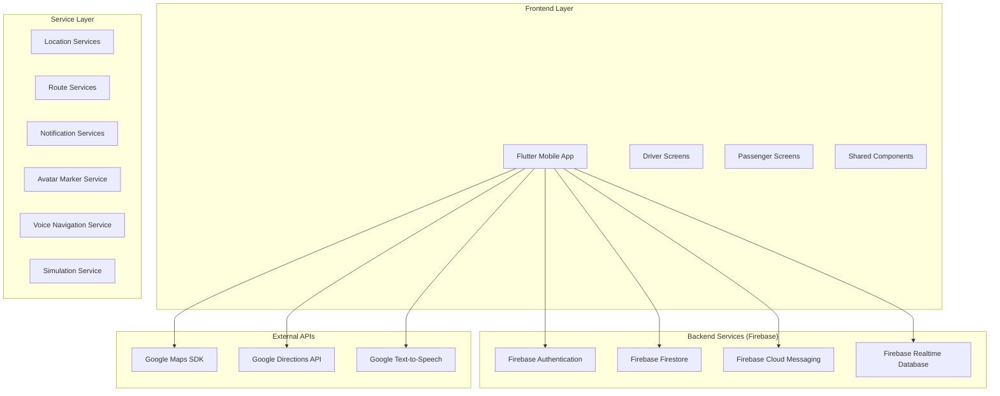
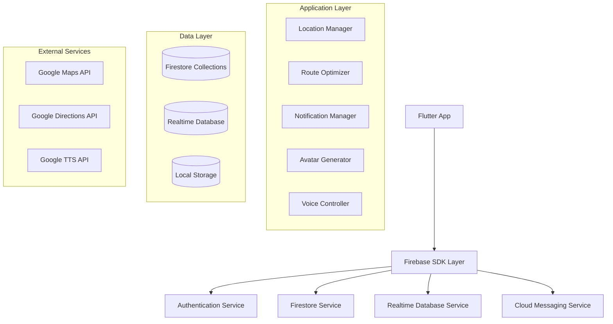
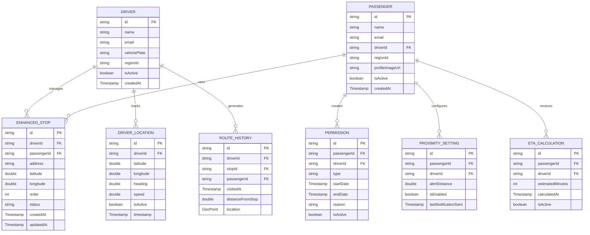

# Servis Takip Uygulaması - Teknik Mimari Dokümantasyonu

## 1. Mimari Tasarım



## 2. Teknoloji Açıklaması

* **Frontend**: Flutter\@3.16 + Dart\@3.2

* **State Management**: Provider\@6.1.1 + setState

* **Maps**: google\_maps\_flutter\@2.5.0

* **Location**: geolocator\@10.1.0 + location\@5.0.3

* **Backend**: Firebase (Firestore, Auth, FCM, Realtime DB)

* **HTTP Client**: http\@1.1.0

* **Image Processing**: flutter\_image\@4.1.0

* **Audio**: flutter\_tts\@3.8.5

* **Permissions**: permission\_handler\@11.2.0

## 3. Rota Tanımları

| Rota                | Amaç                                                   |
| ------------------- | ------------------------------------------------------ |
| /driver\_home       | Şoför ana sayfası, dashboard ve hızlı erişim           |
| /enhanced\_map      | Gelişmiş harita ekranı, avatar duraklar ve yol tarifi  |
| /driver\_profile    | Şoför profil sayfası, araç bilgileri ve ayarlar        |
| /messages           | Mesajlaşma ekranı, yolcu iletişimi                     |
| /passenger\_home    | Yolcu ana sayfası, servis durumu ve ETA kartı          |
| /service\_tracking  | Yolcu servis takip ekranı, gerçek zamanlı şoför takibi |
| /permission\_screen | İzin bildirimi ekranı, sabah/akşam/tatil izinleri      |
| /passenger\_profile | Yolcu profil sayfası, bildirim ayarları                |
| /test\_simulation   | Test modu ekranı, şoför hareket simülasyonu            |

## 4. API Tanımları

### 4.1 Temel Servisler

**Avatar Marker Service**

```dart
class AvatarMarkerService {
  static Future<BitmapDescriptor> createAvatarMarker({
    required String? profileImageUrl,
    required int stopNumber,
    required double size,
  });
}
```

**Voice Navigation Service**

```dart
class VoiceNavigationService {
  static Future<void> speakDirection(String instruction);
  static Future<void> startNavigation(List<LatLng> route);
  static void stopNavigation();
}
```

**Simulation Service**

```dart
class SimulationService {
  static Future<void> startDriverSimulation({
    required String driverId,
    required List<LatLng> route,
    required Duration interval,
  });
  static void stopSimulation();
  static Stream<LatLng> getSimulationStream();
}
```

**ETA Calculation Service**

```dart
class ETACalculationService {
  static Future<Duration> calculateETA({
    required LatLng driverLocation,
    required LatLng passengerStop,
    required List<LatLng> remainingStops,
  });
  static Stream<Duration> getRealtimeETA(String passengerId);
}
```

### 4.2 Firebase API Entegrasyonları

**Driver Location Updates**

```dart
// Firestore Collection: driver_locations
{
  "driverId": "string",
  "latitude": "double",
  "longitude": "double",
  "heading": "double",
  "speed": "double",
  "timestamp": "Timestamp",
  "isActive": "boolean"
}
```

**Route History Tracking**

```dart
// Firestore Collection: route_history
{
  "driverId": "string",
  "stopId": "string",
  "passengerId": "string",
  "visitedAt": "Timestamp",
  "location": {
    "latitude": "double",
    "longitude": "double"
  },
  "distanceFromStop": "double"
}
```

**Proximity Notifications**

```dart
// Firestore Collection: proximity_settings
{
  "passengerId": "string",
  "driverId": "string",
  "alertDistance": "double", // meters
  "isEnabled": "boolean",
  "lastNotificationSent": "Timestamp"
}
```

### 4.3 Google APIs Entegrasyonu

**Directions API Request**

```dart
class DirectionsRequest {
  final LatLng origin;
  final LatLng destination;
  final List<LatLng> waypoints;
  final bool optimizeWaypoints;
  final String travelMode; // driving
  final bool avoidTolls;
  final bool avoidHighways;
}
```

**Directions API Response**

```dart
class DirectionsResponse {
  final List<LatLng> polylinePoints;
  final String totalDistance;
  final String totalDuration;
  final List<DirectionStep> steps;
  final LatLngBounds bounds;
}

class DirectionStep {
  final String instruction;
  final String distance;
  final String duration;
  final LatLng startLocation;
  final LatLng endLocation;
}
```

## 5. Sunucu Mimarisi



## 6. Veri Modeli

### 6.1 Veri Modeli Tanımı



### 6.2 Veri Tanımlama Dili (DDL)

**Enhanced Stops Collection**

```javascript
// Firestore Collection: enhanced_stops
// Index: driverId, isActive, order
// Index: passengerId, isActive
// Index: regionId, isActive

// Security Rules
rules_version = '2';
service cloud.firestore {
  match /databases/{database}/documents {
    match /enhanced_stops/{stopId} {
      allow read, write: if request.auth != null && 
        (resource.data.driverId == request.auth.uid || 
         resource.data.passengerId == request.auth.uid);
    }
  }
}
```

**Driver Locations Collection**

```javascript
// Firestore Collection: driver_locations
// Index: driverId, timestamp DESC
// Index: isActive, timestamp DESC

// Real-time updates için Realtime Database kullanımı
// Path: /driver_locations/{driverId}
{
  "latitude": 41.0082,
  "longitude": 28.9784,
  "heading": 45.5,
  "speed": 25.0,
  "isActive": true,
  "timestamp": 1703123456789
}
```

**Route History Collection**

```javascript
// Firestore Collection: route_history
// Index: driverId, visitedAt DESC
// Index: passengerId, visitedAt DESC
// Index: stopId, visitedAt DESC

// Composite Index: driverId, visitedAt DESC, passengerId
```

**Proximity Settings Collection**

```javascript
// Firestore Collection: proximity_settings
// Index: passengerId, isEnabled
// Index: driverId, isEnabled

// Initial Data
{
  "passengerId": "passenger_123",
  "driverId": "driver_456",
  "alertDistance": 100.0,
  "isEnabled": true,
  "lastNotificationSent": null,
  "createdAt": "2024-01-01T00:00:00Z"
}
```

**ETA Calculations Collection**

```javascript
// Firestore Collection: eta_calculations
// Index: passengerId, calculatedAt DESC
// Index: driverId, calculatedAt DESC
// Index: isActive, calculatedAt DESC

// TTL: 1 hour (otomatik silme)
```

## 7. Güvenlik ve Performans

### 7.1 Firebase Security Rules

```javascript
rules_version = '2';
service cloud.firestore {
  match /databases/{database}/documents {
    // Driver locations - sadece ilgili şoför ve yolcular erişebilir
    match /driver_locations/{driverId} {
      allow read: if request.auth != null && 
        (request.auth.uid == driverId || 
         exists(/databases/$(database)/documents/passengers/$(request.auth.uid)) &&
         get(/databases/$(database)/documents/passengers/$(request.auth.uid)).data.driverId == driverId);
      allow write: if request.auth != null && request.auth.uid == driverId;
    }
    
    // Route history - sadece ilgili şoför ve yolcu erişebilir
    match /route_history/{historyId} {
      allow read, write: if request.auth != null && 
        (resource.data.driverId == request.auth.uid || 
         resource.data.passengerId == request.auth.uid);
    }
  }
}
```

### 7.2 Performans Optimizasyonları

* **Bitmap Caching**: Avatar marker'ları için LRU cache implementasyonu

* **Location Throttling**: Konum güncellemelerini 5 saniyede bir sınırlama

* **Firestore Pagination**: Büyük veri setleri için sayfalama

* **Background Processing**: Ağır işlemler için isolate kullanımı

* **Memory Management**: Büyük bitmap'lerin otomatik temizlenmesi

### 7.3 Offline Desteği

* **Local Database**: SQLite ile kritik verilerin yerel saklanması

* **Sync Mechanism**: İnternet bağlantısı geldiğinde otomatik senkronizasyon

* **Cached Maps**: Google Maps offline tile caching

* **Queue System**: Offline işlemler için kuyruk sistemi

